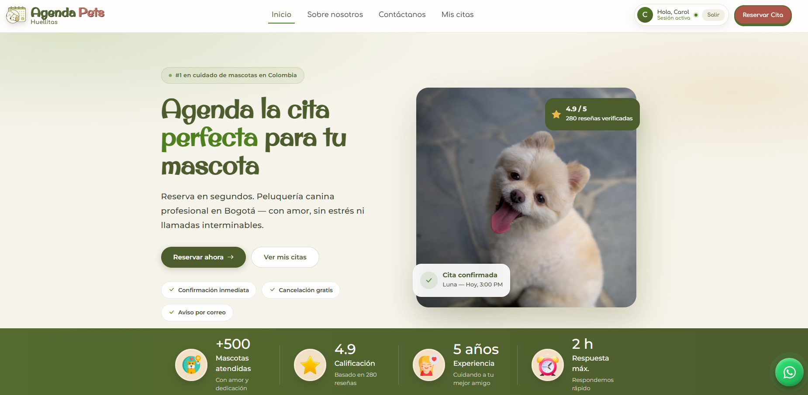
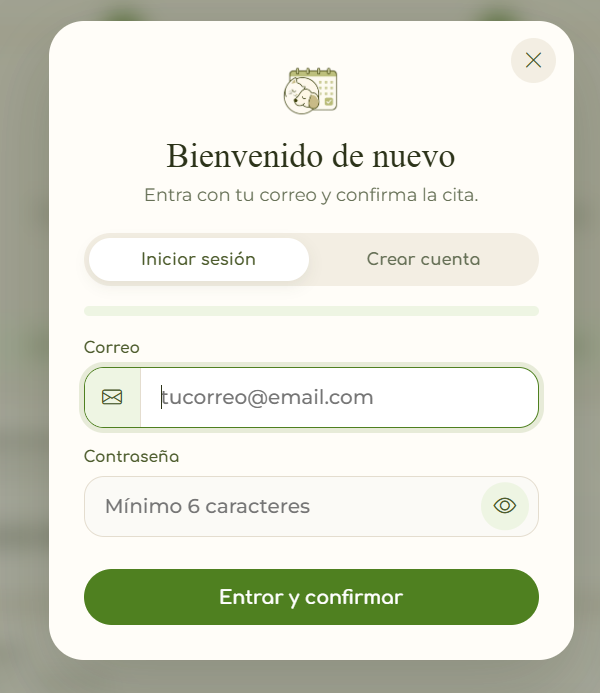
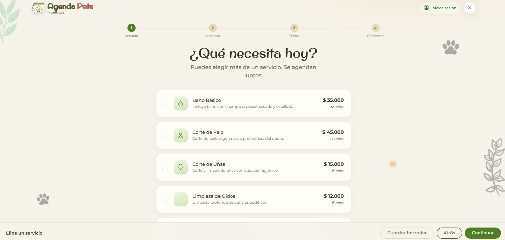
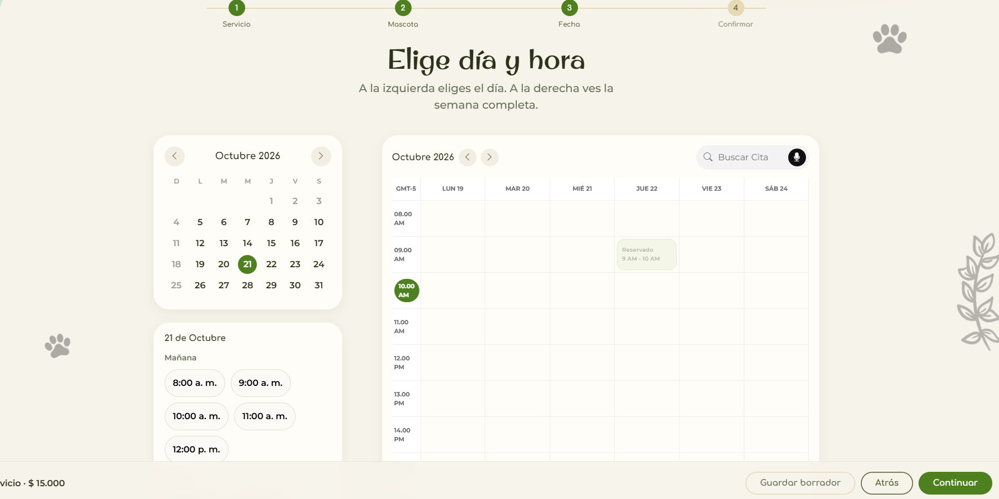
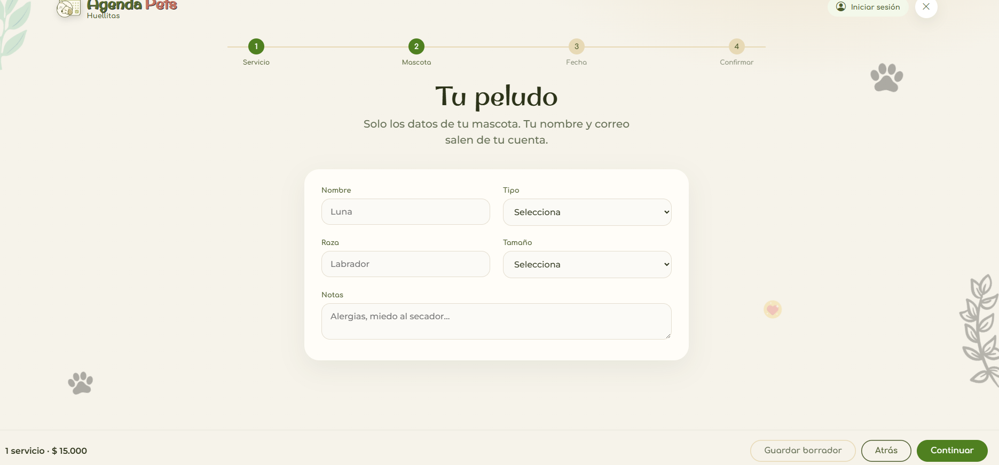
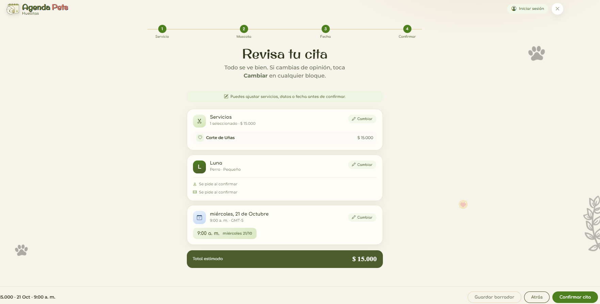
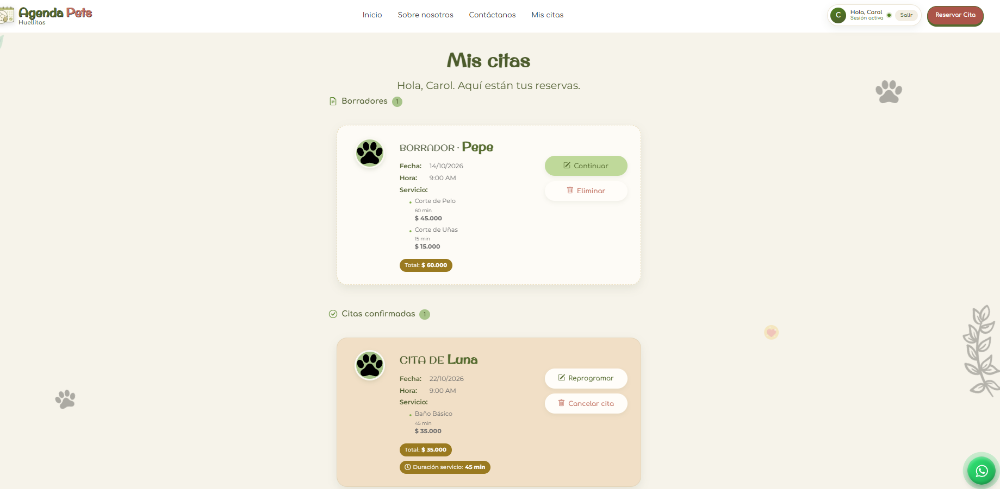
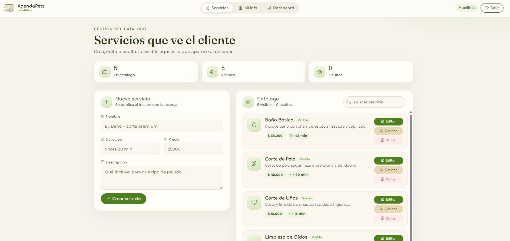
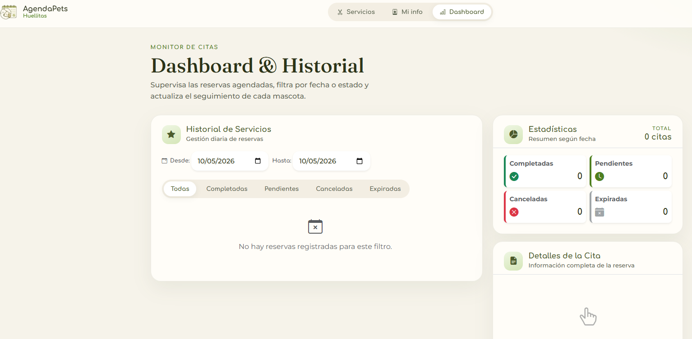
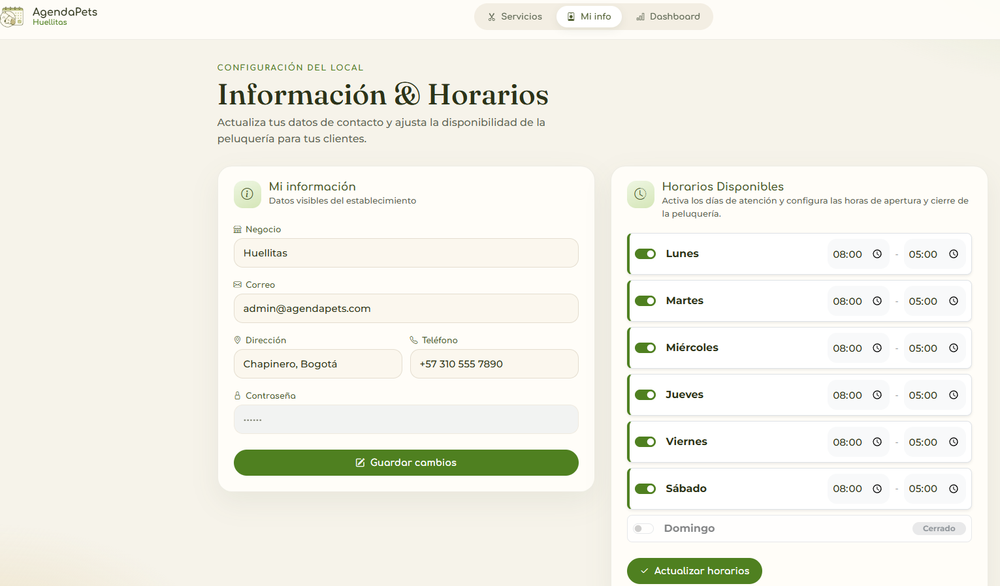

<p align="center">
  
</p>

<h1 align="center"> 🐾 AGENDAPETS — Reservas Pet Grooming 🐶</h1>

<p align="center">
  <a href="https://agendapets1.vercel.app/" target="_blank">
    
  </a>
  <a href="https://agendapets-api-carol.onrender.com/api/health" target="_blank">
    
  </a>
  <a href="https://github.com/CarolPinerosTrujillo/AgendaPets" target="_blank">
    
  </a>
  <a href="https://github.com/CarolPinerosTrujillo/Backend_AgendaPets" target="_blank">
    
  </a>
  
</p>

---

## 🚀 Demo en vivo

**👉 [https://agendapets1.vercel.app](https://agendapets1.vercel.app)**

> ⏱️ **Nota:** el backend corre en el plan gratuito de Render, que se duerme tras unos minutos sin tráfico. **La primera carga puede tardar ~1 minuto**; después todo responde normal.

> 🔑 **Acceso al panel de administración:** las credenciales de demo están disponibles **bajo petición**. Escríbeme y te las comparto (no se publican por seguridad).

---

## 📸 Galería

### Inicio y acceso

<p align="center">
  
</p>
<p align="center"><em>🏠 Página de inicio</em></p>

<p align="center">
  
</p>
<p align="center"><em>🔐 Inicio de sesión (modal con JWT)</em></p>

### Flujo de reserva (4 pasos)

<p align="center">
  
  
</p>
<p align="center"><em>💇 Paso 1: elegir servicio &nbsp;·&nbsp; 📅 Paso 2: fecha y hora (horarios ocupados en tiempo real)</em></p>

<p align="center">
  
  
</p>
<p align="center"><em>🐾 Paso 3: datos de la mascota &nbsp;·&nbsp; ✅ Paso 4: resumen y confirmación</em></p>

### Cliente

<p align="center">
  
</p>
<p align="center"><em>📅 Mis citas: reprogramar y cancelar reservas</em></p>

### Panel de administración

<p align="center">
  
  
</p>
<p align="center"><em>🛠️ Gestión de servicios &nbsp;·&nbsp; 📊 Resumen de citas</em></p>

<p align="center">
  
</p>
<p align="center"><em>👤 Panel admin: mi información</em></p>

---

## 📋 Descripción

Plataforma web para la gestión de reservas de servicios de **pet grooming**, diseñada para optimizar procesos, mejorar la experiencia del usuario y garantizar el bienestar de las mascotas. Incluye panel de administrador funcional con historial de servicios.

**Flujo principal:** el cliente se registra, elige un servicio, selecciona fecha y hora (viendo los horarios ya ocupados), completa los datos de su mascota y confirma la cita. Luego puede ver, reprogramar o cancelar sus citas. El administrador gestiona el catálogo de servicios y supervisa las reservas.

---

## ✅ Funcionalidades

### 🔐 Autenticación
- Registro de usuarios (ADMIN / CLIENTE)
- Inicio de sesión con **JWT** (token stateless)
- Protección de rutas por roles

### 📅 Reservas
- Crear reservas de servicios para mascotas
- Calendario con **horarios ocupados en tiempo real**
- Reprogramar y cancelar citas
- Seguimiento de estados de la reserva

### 🐕 Gestión de Mascotas
- Registrar, editar y eliminar mascotas asociadas al cliente

### 💇 Servicios
- Catálogo con precios y duraciones
- Administración completa desde el panel admin (alta, edición, visibilidad)

### 🔍 Consultas
- Búsquedas por correo, usuario, fecha y estado

### 📊 Panel de Administrador
- CRUD de servicios, resumen de citas, historial y supervisión de clientes

---

## 🏗️ Arquitectura

```
 Navegador
    │
    ▼
 Vercel  (este repo: HTML / CSS / JS)
 │   js/config.js  →  apiUrl (producción o localhost)
 │   js/api.js     →  fetch + Authorization: Bearer <JWT>
    │
    ▼
 Render  (repo Backend: Spring Boot + Docker)
 │   /api/auth · /api/servicios · /api/reservas · /api/health
    │  JDBC (host directo)
    ▼
 Neon  (PostgreSQL en la nube)
```

| Pieza | Plataforma | URL |
|-------|-----------|-----|
| Frontend | Vercel | https://agendapets1.vercel.app |
| API REST | Render | https://agendapets-api-carol.onrender.com |
| Base de datos | Neon (PostgreSQL) | host directo `ep-royal-union…us-east-2.aws.neon.tech` |

---

## 🛠️ Stack Tecnológico

### Frontend
| Tecnología | Descripción |
|------------|-------------|
| JavaScript | Lógica de la aplicación, cliente HTTP propio (`js/api.js`) |
| HTML5 | Estructura de las páginas |
| CSS3 | Estilos y diseño responsive |

### Backend (repositorio separado)
| Tecnología | Versión |
|------------|---------|
| Java | 17 |
| Spring Boot | 3.3.4 |
| Spring Security + JWT | jjwt 0.12.6 |
| PostgreSQL | Neon Cloud |
| Docker | Multi-stage build (Render) |

> 📦 Documentación completa del backend: [CarolPinerosTrujillo/Backend_AgendaPets](https://github.com/CarolPinerosTrujillo/Backend_AgendaPets)

---

## ▶️ Ejecución local

### 1. Backend
```bash
git clone https://github.com/CarolPinerosTrujillo/Backend_AgendaPets.git
cd Backend_AgendaPets
# crea un .env con SPRING_DATASOURCE_URL, USERNAME, PASSWORD y JWT_SECRET (≥32 chars)
mvnw.cmd spring-boot:run        # Windows
./mvnw spring-boot:run          # Linux/Mac
```
La API queda en `http://localhost:8080`.

### 2. Frontend
```bash
git clone https://github.com/CarolPinerosTrujillo/AgendaPets.git
cd AgendaPets
```
Ábrelo con **Live Server** (VS Code) o `npx serve` en `localhost`. `js/config.js` detecta el host y usa `http://localhost:8080`.

---

## 📁 Estructura del proyecto

```
AgendaPets/
├── assets/
│   ├── screenshots/      ← capturas de esta README
│   ├── logo.png
│   ├── team/, icons/, img/ ...
├── js/
│   ├── config.js         ← define AGENDA_PETS_CONFIG.apiUrl
│   ├── api.js            ← cliente HTTP (AgendaApi) con JWT
│   ├── auth.js           ← sesión en localStorage
│   ├── reservar.js       ← flujo de reserva + calendario
│   ├── citas.js          ← mis citas
│   ├── admin.js          ← panel de administración
│   └── mi-info.js
├── VAdmin/               ← panel del administrador
├── index.html, home.html, reservar.html, citas-usuario.html, iniciarSesion.html...
├── styles.css
├── vercel.json           ← sitio estático (cleanUrls)
└── despliegue-produccion.md
```

---

## 📂 Repositorios

| Repositorio | Descripción |
|-------------|-------------|
| [CarolPinerosTrujillo/AgendaPets](https://github.com/CarolPinerosTrujillo/AgendaPets) | Frontend (HTML, CSS, JS) — este repositorio |
| [CarolPinerosTrujillo/Backend_AgendaPets](https://github.com/CarolPinerosTrujillo/Backend_AgendaPets) | Backend (Spring Boot + Docker) |

---

## 👩‍💻 Equipo de Desarrollo (Bootcamp Generation)

- Juan Carlos Pastas
- Carol Piñeros
- Diego Rojas
- Juan Camilo Acevedo
- Valería Díaz

> 📌 **Proyecto original del bootcamp Generation.** Fork, despliegue y mantenimiento propio por **Carol Piñeros** (frontend en Vercel, API en Render, base de datos en Neon).

---

## 📄 Licencia

Este proyecto está bajo la licencia MIT. Ver el archivo [LICENSE](LICENSE) para más detalles.

---

## 🟢 Estado del proyecto

✅ Demo funcional en Vercel + API en Render + PostgreSQL en Neon
